*[Show in Finder](./)*

# 09 - 01
# 工具篇 - 日志目录便利创建器
#### 摘要:
* [00. 碎碎念](https://github.com/Jefrl/copyFileToCustomPath#-00-碎碎念--️️️) --  👈  
* [01. 文字说明](https://github.com/Jefrl/copyFileToCustomPath#-01-文字说明--️️️) --  👈  
* [02. 图片说明](https://github.com/Jefrl/copyFileToCustomPath#-02-图片说明--️️️) --  👈  
* [03. 更新说明](https://github.com/Jefrl/copyFileToCustomPath#-03-更新说明--️️️) --  👈 

##  00. 碎碎念  [⚡️⚡️⚡️](https://github.com/Jefrl/copyFileToCustomPath#摘要)
* 自己用 markDown 编写日记的模板格式, 文件数目, 内部文件夹, 时不时会调整下, 然后需要统一布局到当前月份子目录内, 详见后面说明与动图; 

##  01. 文字说明  [⚡️⚡️⚡️](https://github.com/Jefrl/copyFileToCustomPath/README.md#摘要)
1. 所有操作都默认从 01 至 31 日;  

2. 若设定起始日期,  那么操作范围从指定日期(包含当天) 至 31 日;  

3. 添加操作中同名文件的覆盖,  以及删除指定文件的操作, 都只针对文件操作, 不处理文件夹;  

4. 最后一个操作代表日期内的文件夹也一并删除,  确实需要删除文件夹时使用 !!!

##  02. 图片说明  [⚡️⚡️⚡️](https://github.com/Jefrl/copyFileToCustomPath#摘要)
#### 一. 动图总览
 
* 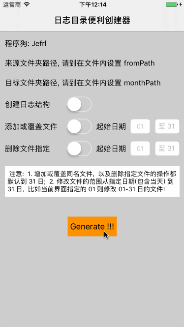

#### 二. 截图操作说明

 **路径设置:** 输入输出路径 

 * 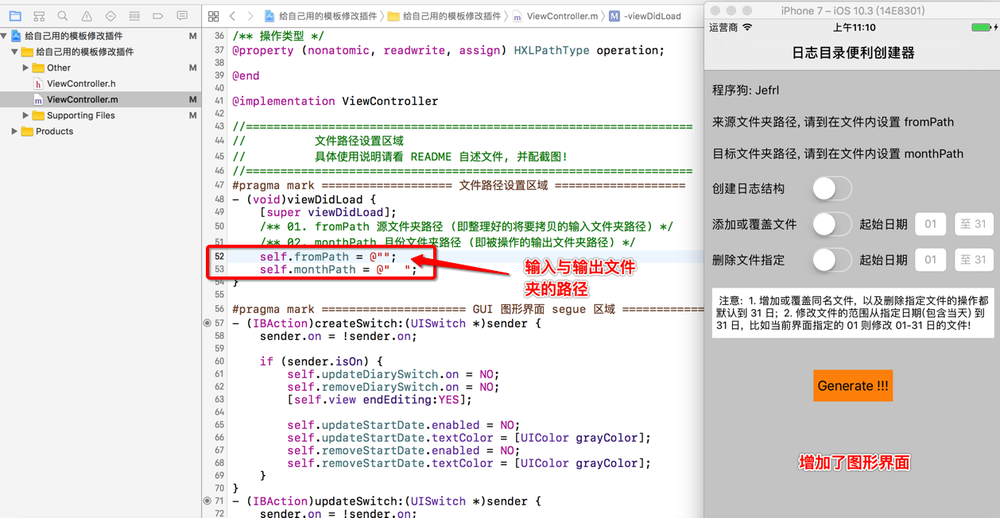  

**操作一:** 新建日志结构

 * 0, 自己将创建 9月份的日志结构; 建立 09月文件夹作为输出文件夹;
 * 1, 创建输入文件夹 from, 并将准备好的文件 job.md 与文件夹 images 放入;

 * 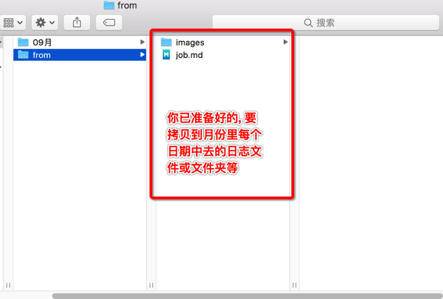  	

 * 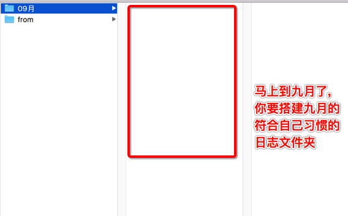  

 * 2, 填写好输入输出文件夹路径
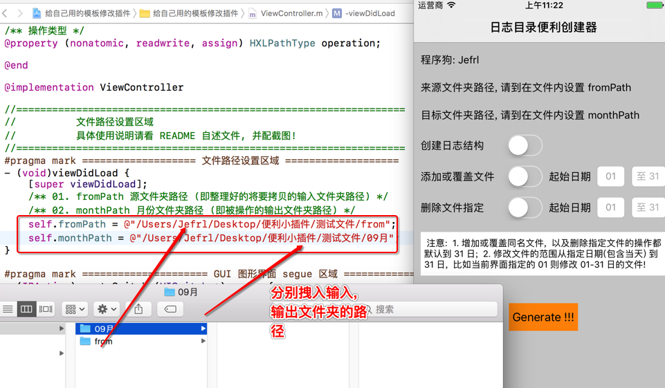

 * 3, 在图形界面, 选择创建功能, 点击 Generate 后, 输出文件夹 09月中就布局好了;
 * 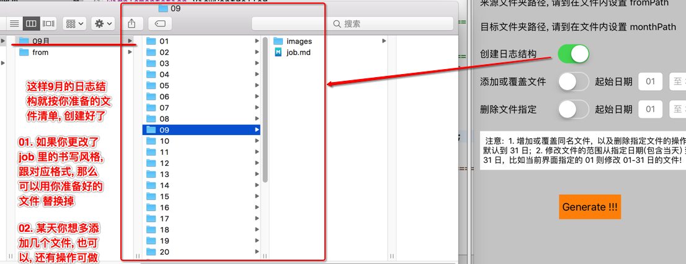 

---

**操作二:** 添加文件, 替换同名文件的操作
 * 0, 假设你想添加 learning.md, life.md 跟 01.png 这三个文件, 统一布局到 09月文件夹内部的日期内; 
 * 1, 并且你还更改了 job.md 文件内部的格式, 想替换掉之前的job.md文件;
 
 * 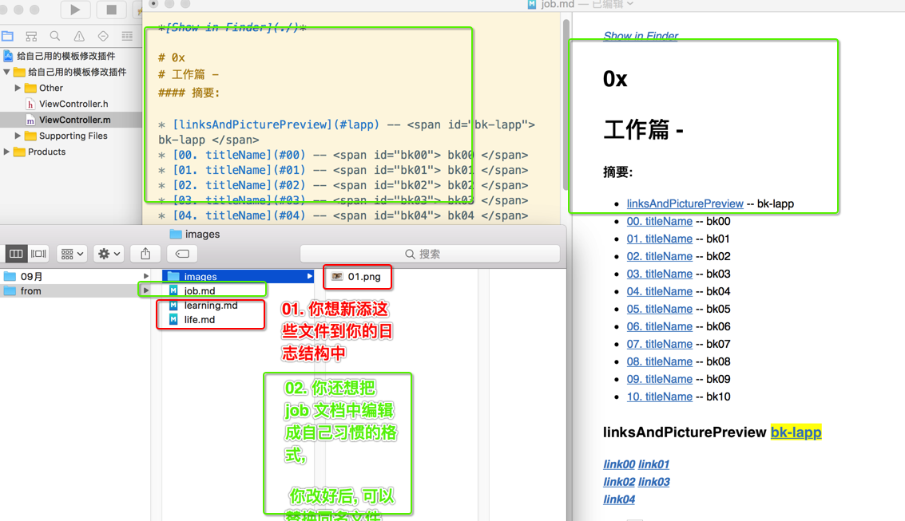  
 * 2, 图形界面, 选择添加覆盖功能, 点击 Generate 后的输出文件夹 09月中就布局好了;
 * 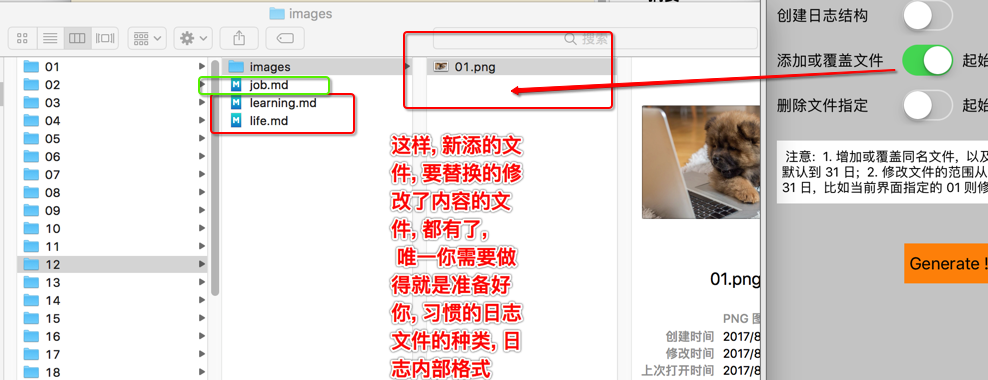

---

**操作三:** 删除文件操作
 * 0, 假设你想删除日志 09月中布局的文件, 比如如图所示的 "多添加的文件01, 多添加的文件02";
 
 * 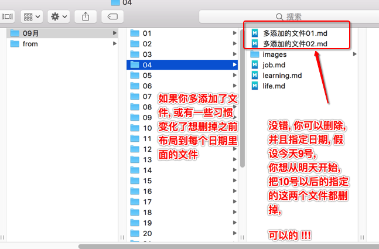
 
 * 1, 只需把这个两个文件放入, 文件夹 from 中; 
 * 2, 图形界面, 选择删除功能, 点击 Generate 后, 09月中所有的日期文件夹都删除了这两个文件; 
 * 3, 还可以选择操作范围, 这里勾选了删除的起始日期 10号, 那么操作范围就变为09月10日 - 09月31日 ;
 
 * 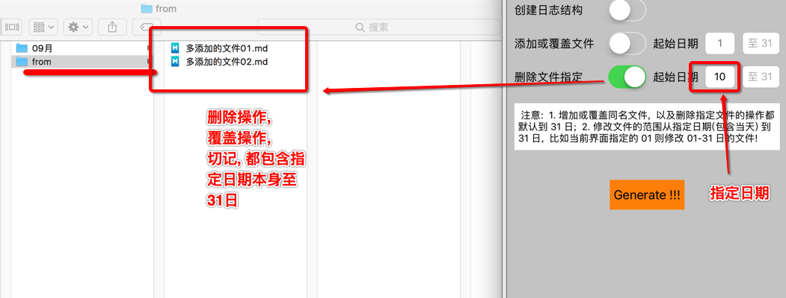  
 
 * 8, 再放上一张对比 10日 前跟 10日 后的, 删除操作的结果图
 
 * 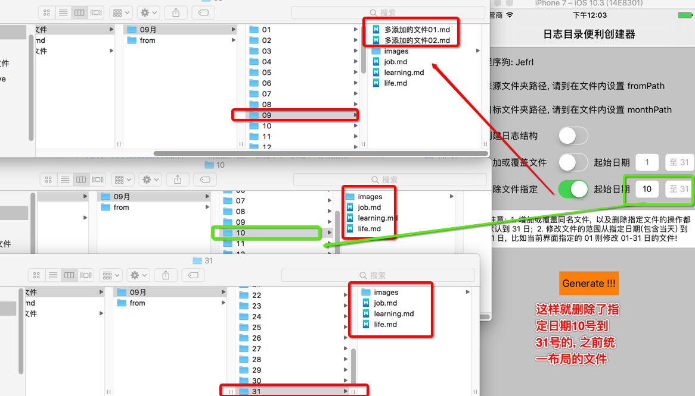  

##  03. 更新说明  [⚡️⚡️⚡️](https://github.com/Jefrl/copyFileToCustomPath#摘要)

一. 初始只具备创建日志结构功能;

二. 具备添加文件功能, 及替换修改了的文件功能;

三. 更新至版本 0.1.0 
 
 * 1, 新增 GUI 图形界面
 * 2, 增加指定日期的操作范围
 * 3, 新增删除文件功能 
 * 4, 实际使用过程中, 确定设计原则, 在删除文件与替换同名文件上, 只针对文件操作, 不操作文件夹 ; (如: 添加文件夹时, 如果已有该文件夹, 不会发生替换; 删除文件时, 也不会删除文件夹, 只删除文件夹内部包含的文件)

四. 更新至版本 0.1.1
  
  * 1, 添加功能选项, 删除文件, 同时也包括删除文件夹的选项; 扩大了删除文件的操作权限, 可以处理文件夹;

---

###### 后记: 原本是给自己用的, 风说挺实用, 然后就加了图形界面跟 README 文件, 不足之处多包涵, 并联系我! [附在 GitHub 上的链接](https://github.com/Jefrl/copyFileToCustomPath)